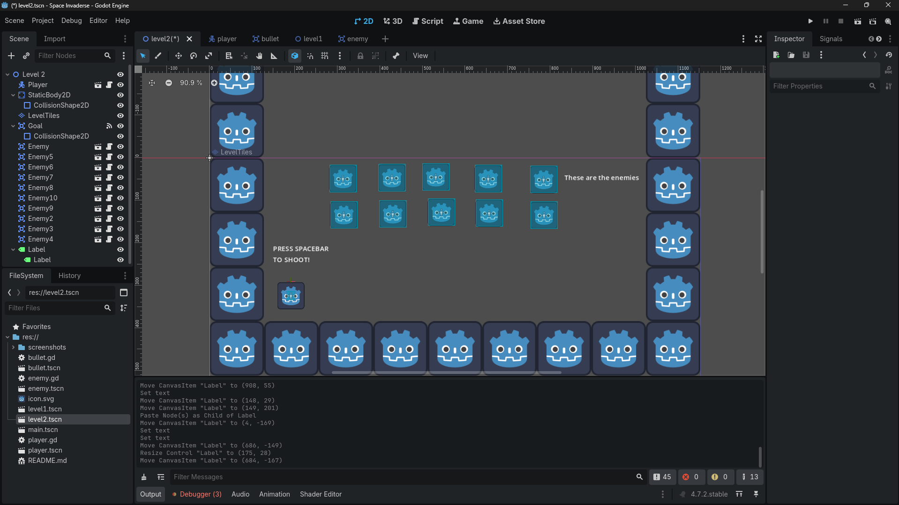
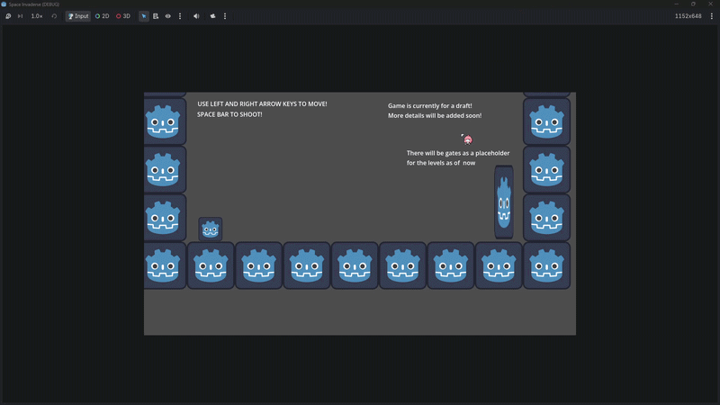
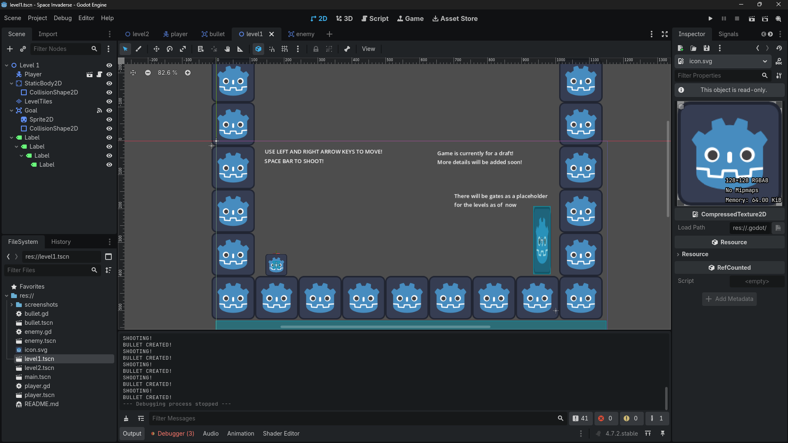
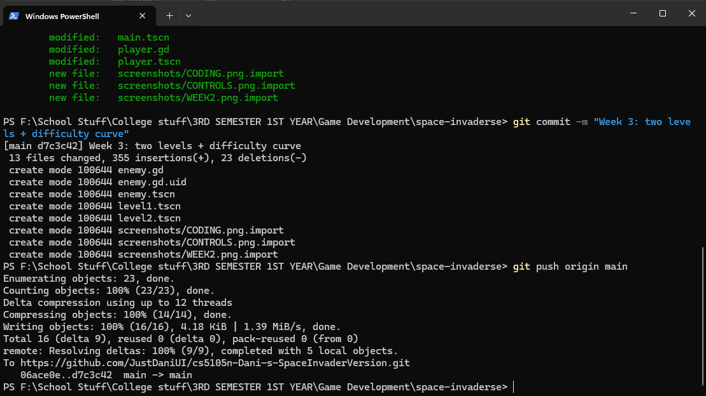

# Space Invaders

## CS-5105N Game Development

### Activity 1 — Godot & Git Setup

## 1. Introduction

This activity focuses on setting up the Godot game development environment,

creating a basic 2D scene, and configuring Git and GitHub for version control.

## 2. Game Concept

**Game Title:** Space Invaders

**Genre:** 2D Arcade / Shooter

The project is inspired by the classic Space Invaders concept. The planned

game will involve controlling a player-controlled spacecraft while defending

against enemy invaders.

## 3. Godot Project Setup

Godot was installed and a new 2D project was created for the game.

The main scene was created using a `Node2D` as the root node. A `Sprite2D`

was then added as a child node.

### Project Files

The project contains the necessary Godot project files and folders.

## 4. Hello World Scene

A `Label` node was added to the scene to display the text "Hello World!".

The scene was then run successfully using Godot.

### Screenshot — Godot Scene

### Screenshot — Running Game

## 5. Git and GitHub Setup

Git was initialized inside the Godot project directory and the project was

connected to a GitHub repository.

A `.gitignore` file was configured to prevent Godot-generated files such as

the `.godot` directory from being unnecessarily committed.

Git LFS was also configured for large game assets.

### Git Setup

The Git repository was initialized and configured through the terminal.

### Console Commands

The following screenshot documents the console commands used during the

Git and project setup process.

### GitHub Repository

The completed project was connected to its GitHub repository.

## 6. Version Control

The project was committed using Git and pushed to the GitHub repository.

The console output below shows the successful `git push` operation to the

`main` branch.

### Screenshot — Git Push

---------------------------------------------------------

# Activity 2 — Gameplay Mechanics & Game Feel

## 7. Week 2 — Gameplay Mechanics & Game Feel

### Objective

This activity focused on implementing the core gameplay mechanics of the

Space Invaders project and adding a game-feel element to make the gameplay

more responsive.

### Player Mechanics

A `CharacterBody2D` was created for the player. The player was programmed

to move left and right and interact with the game environment.

### Player Controls

| Key | Action |
|---|---|
| ← | Move Left |
| → | Move Right |
| Space | Shoot |

### Shooting Mechanic

A separate `Area2D` bullet scene was created with a `Sprite2D` and

`CollisionShape2D`. The player can shoot bullets that travel upward.

### Game Feel / Juice

A squash-and-stretch effect was added when the player shoots. The player

briefly becomes wider and shorter before returning to its normal scale,

providing visual feedback when shooting.

### Gameplay Test

The following GIF demonstrates the player movement, shooting,

and bullet movement during gameplay testing.

### Development Evidence

Additional screenshots document the coding and control implementation.

### Week 2 Git Push

The completed Week 2 implementation was committed and pushed to the

GitHub repository.

Commit message:

`Week 2: core mechanic + juice`

Commit:

`c8d4024`

---------------------------------------------------------

# Activity 3 — Level Design

## 8. Week 3 — Level Design & Difficulty Curve

### Objective

This activity focused on creating two playable levels, introducing a clear

difficulty progression, and designing a readable game space for the player.

### Level 1 — Tutorial Level

Level 1 was designed to introduce the player to the basic gameplay mechanics.

The player can move left and right and shoot bullets using the Space key.

A goal area was also added to allow the player to transition to Level 2.

The level uses boundary walls to keep the player inside the playable area.

### Level 2 — Increased Difficulty

Level 2 builds on the mechanics introduced in Level 1 and increases the

challenge by adding multiple enemy targets.

The player must use the shooting mechanic to destroy the enemies while

navigating the level.

Enemies disappear when hit by a player's bullet.

### Enemy System

A separate enemy scene was created using an `Area2D`, `Sprite2D`, and

`CollisionShape2D`.

An enemy can detect when it is hit by a bullet and is removed from the

level after being hit.

### Collision and Level Boundaries

Tile-based collision was added to the level boundaries.

This prevents the player from moving outside the playable area and keeps

the gameplay space clearly defined.

### Difficulty Progression

The two levels provide a simple difficulty curve:

- **Level 1:** Introduces movement, shooting, boundaries, and the goal.
- **Level 2:** Adds multiple enemies and requires the player to use shooting
  more actively.

This allows the player to learn the core mechanic before encountering the

additional challenge in Level 2.

### Inclusive and Readable Design

The levels use simple controls and clearly defined boundaries to make the

gameplay easy to understand.

The player only needs the left and right arrow keys for movement and the

Space key for shooting. The consistent level boundaries also help the player

understand where they can move.

### Level 2 Screenshot

### Gameplay Test

The following GIF demonstrates the completed two-level gameplay flow,

including player movement, shooting, level transition, and enemy interaction.

### Week 3 Documentation

The following screenshot documents the labels and level design work completed

during Week 3.

### Week 3 Git Push

The completed Week 3 implementation was committed and pushed to the GitHub

repository.

Commit message:

`Week 3: two levels + difficulty curve`

Commit:

`d7c3c42`

