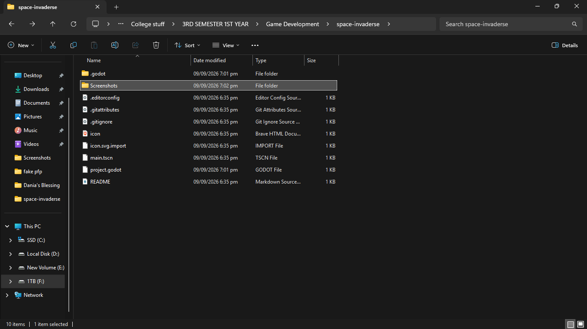
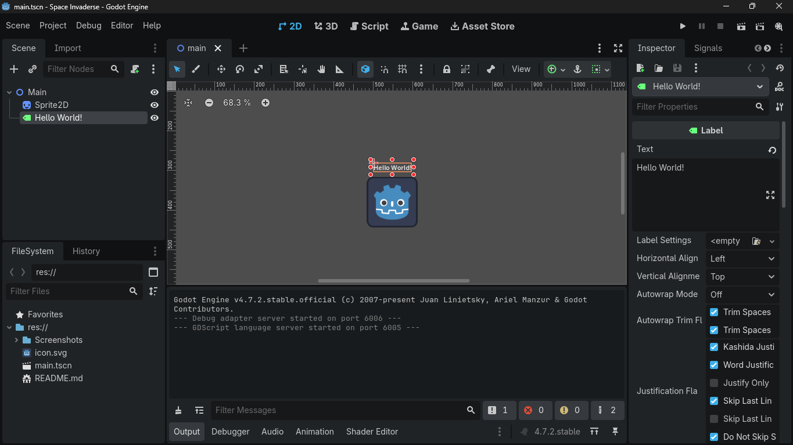
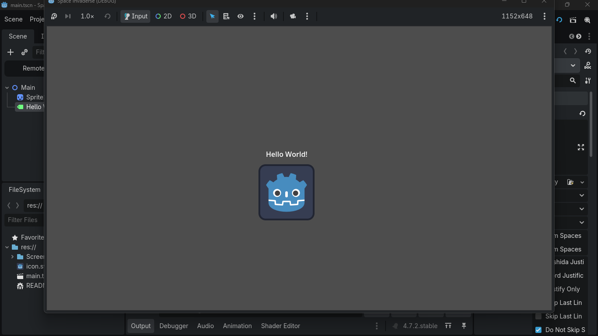
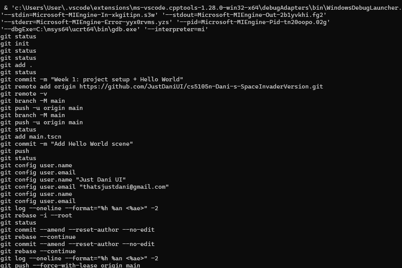
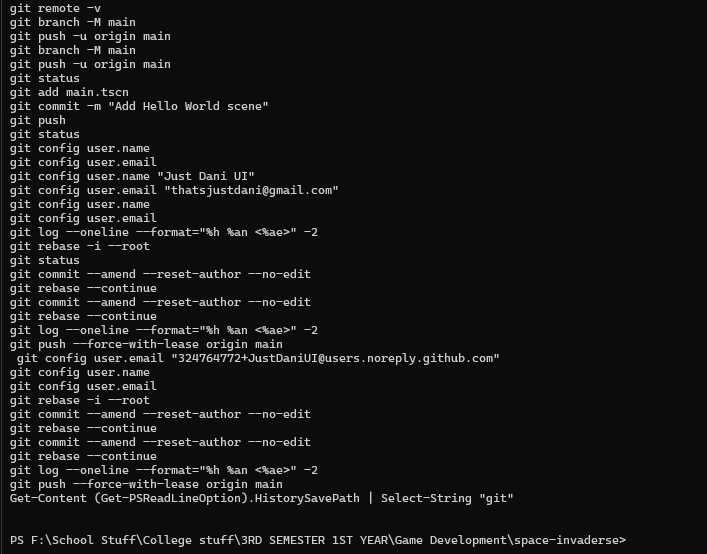
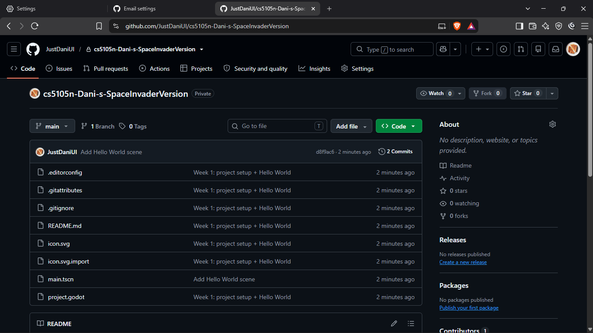
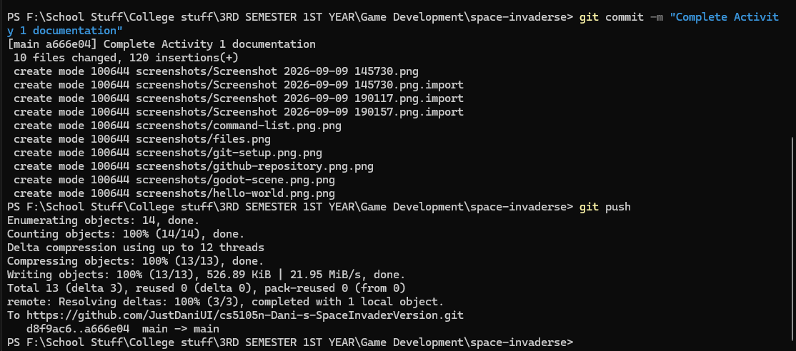

# Space Invaders

## CS-5105N Game Development

### Activity 1 — Godot & Git Setup

## 1. Introduction

This activity focuses on setting up the Godot game development environment,
creating a basic 2D scene, and configuring Git and GitHub for version control.

## 2. Game Concept

**Game Title:** Space Invaders

**Genre:** 2D Arcade / Shooter

The project is inspired by the classic Space Invaders concept. The planned
game will involve controlling a player-controlled spacecraft while defending
against enemy invaders.

## 3. Godot Project Setup

Godot was installed and a new 2D project was created for the game.

The main scene was created using a `Node2D` as the root node. A `Sprite2D`
was then added as a child node.

### Project Files

The project contains the necessary Godot project files and folders.

## 4. Hello World Scene

A `Label` node was added to the scene to display the text "Hello World!".

The scene was then run successfully using Godot.

### Screenshot — Godot Scene

### Screenshot — Running Game

## 5. Git and GitHub Setup

Git was initialized inside the Godot project directory and the project was
connected to a GitHub repository.

A `.gitignore` file was configured to prevent Godot-generated files such as
the `.godot` directory from being unnecessarily committed.

Git LFS was also configured for large game assets.

### Git Setup

The Git repository was initialized and configured through the terminal.

### Console Commands

The following screenshot documents the console commands used during the
Git and project setup process.

### GitHub Repository

The completed project was connected to its GitHub repository.

## 6. Version Control

The project was committed using Git and pushed to the GitHub repository.

The console output below shows the successful `git push` operation to the
`main` branch.

### Screenshot — Git Push

